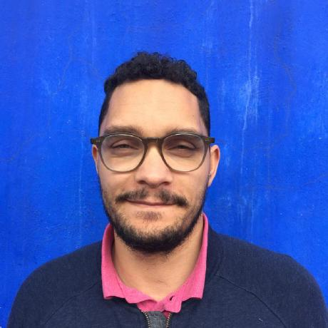

 

## About

Kwame Porter Robinson is a tireless, creative problem solver with a variety research interests, including [generative justice/economics](https://www.researchgate.net/publication/311811471_An_Introduction_to_Generative_Justice), [AI in Society](https://link.springer.com/journal/146), Human-AI teaming (e.g., [Hybrid Intelligence Systems](https://hyints.engin.umich.edu/)) and [natural language understanding](https://en.wikipedia.org/wiki/Natural-language_understanding) (NLU). As an applied computational social scientist his primary methods are experimental, quasi-experimental designs and scalable NLU and Human-AI system development for applied applications. Before academia he worked for 10 years in industry as CEO, researcher, data scientist and machine learning engineer for both government and private corporations. Kwame is a Ph.D. student at the University of Michigan in the School of Information. He is advised by [Dr. Robert](https://sites.google.com/a/umich.edu/lionelrobert/home) and [Dr. Eglash](https://generativejustice.org/).

## Publications

Kwame is currently working under his advisers, [Dr. Robert](https://sites.google.com/a/umich.edu/lionelrobert/home) and [Dr. Eglash](https://generativejustice.org/). He is part of Dr. Robert's [Sharing Economy lab](https://beta.si.umich.edu/people/lionel-robert) and Dr. Eglash's [Culturally Situated Design Tools research lab](https://www.researchgate.net/lab/Ron-Eglashs-Culturally-Situated-Design-Tools-Research-Lab-Ron-Eglash).

Ron Eglash, Lionel P. Robert, Audrey Bennett, Kwame Porter Robinson, Michael L Lachney, William Babbitt. ["Automation for the artisanal economy: enhancing the economic and environmental sustainability of crafting professions with human–machine collaboration"](https://www.researchgate.net/publication/336227027_Automation_for_the_artisanal_economy_enhancing_the_economic_and_environmental_sustainability_of_crafting_professions_with_human-machine_collaboration). September 2019. AI & Society. DOI: 10.1007/s00146-019-00915-w.

Ron Eglash, Lionel P. Robert, Audrey Bennett, Kwame Porter Robinson, Michael L Lachney, William Babbitt. ["AI for a Generative Economy: The Role of Intelligent Systems in Sustaining Unalienated Labor, Environment, and Society".](https://www.researchgate.net/publication/335391995_AI_for_a_Generative_Economy_The_Role_of_Intelligent_Systems_in_Sustaining_Unalienated_Labor_Environment_and_Society) August 2019. Conference: AAAI Fall 2019 Symposium on AI and Work At: Arlington, Virginia USA

Ron Eglash, Lionel P. Robert, Audrey Bennett, Kwame Porter Robinson, Michael L Lachney, William Babbitt. "Automation for the Artisanal Economy: Enhancing the Economic and Environmental Sustainability of Crafting Professions with Human-Machine Collaboration". December 2018. SSRN Electronic Journal. DOI: 10.2139/ssrn.3446265

Kwame Tacumah Porter-Robinson (Kwame Porter Robinson). ["An Energy Efficient Rate Adaptive Distributed Source Coding
Algorithm: RSWITCH".](https://drive.google.com/file/d/0B0z76rIRuw_mLTlpeWZiV2tNaGs/view) December 2012. unpublished.

## Work Biography

Prior to becoming a Ph.D. student at the University of Michigan, Kwame was lead data scientist at [BrightHive](https://www.brigthive.io) where he designed scalable natural language processing systems and algorithms for workforce artificial intelligence applications, including unstructured taxonomy matching and multi-level semantic similarity. In 2015 Kwame created and led a data science consultancy that served a variety of private and public organizations, including the WKKF Foundation and the World Bank.  Additionally, Kwame has worked on classified projects spanning data science, cyber security and telecommunications research for the Department of Defense. 

## Academic Biography
Kwame holds a master’s degree in Computer Science (University of Maryland, Baltimore County), with a thesis on [Slepian-Wolf](https://en.wikipedia.org/wiki/Slepian%E2%80%93Wolf_coding_) [probabilistic source code correlation](https://drive.google.com/file/d/0B0z76rIRuw_mLTlpeWZiV2tNaGs/view), a Bachelor’s degree in Electrical Engineering (New Mexico State University), with a specialization in [control systems](https://en.wikipedia.org/wiki/Control_theory) and a Bachelor's of Fine Art (Boston University). Kwame is a Ph.D. student at the University of Michigan.

## Contact

Feel free to reach out to Kwame at [kwamepr@umich.edu](mailto:kwamepr@umich.edu) and he welcomes focused collaboration across a variety of disciplines.
